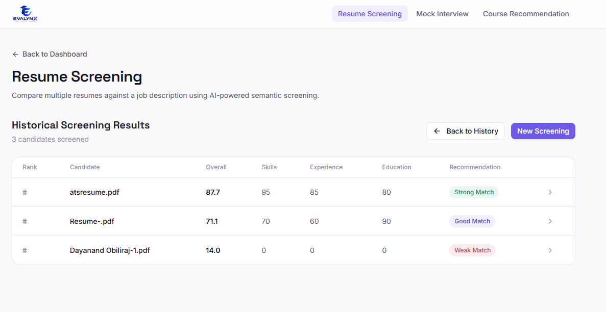
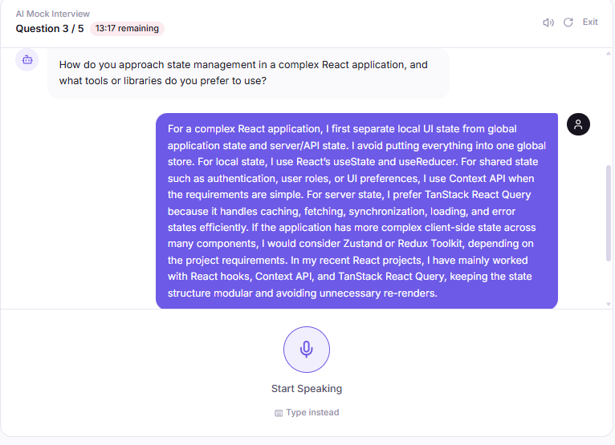
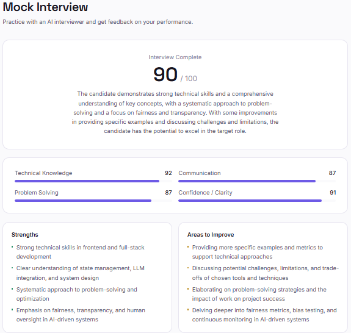
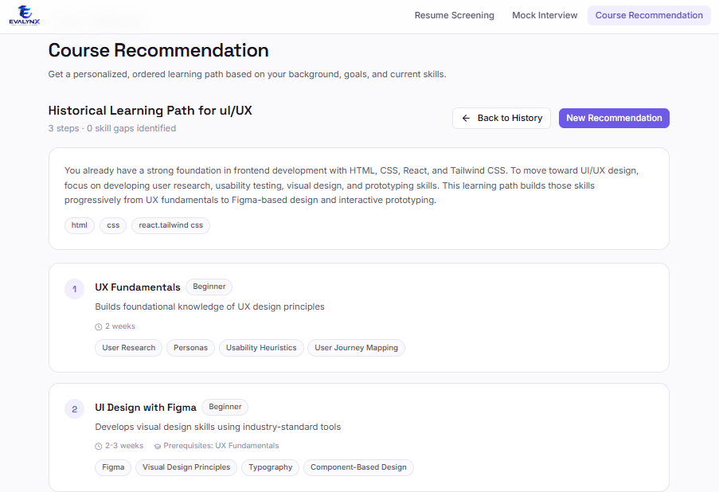

<div align="center">

# 🎯 Evalynx

**AI-powered tools for smarter hiring, interview preparation, and personalized career development.**

[](https://react.dev/)
[](https://www.typescriptlang.org/)
[](https://vitejs.dev/)
[](https://fastapi.tiangolo.com/)
[](https://www.postgresql.org/)
[](#license)

Screen candidates → Practice interviews → Build the right skills.

</div>

---

## 📚 Table of Contents

- [About](#-about)
- [Features](#-features)
- [Screenshots](#-screenshots)
- [Tech Stack](#-tech-stack)
- [Project Structure](#-project-structure)
- [Prerequisites](#-prerequisites)
- [Getting Started](#-getting-started)
- [Environment Variables](#-environment-variables)
- [Proctored Mode Setup](#-proctored-mode-setup)
- [Database & History API](#-database--history-api)
- [Local Development](#-local-development)
- [Testing Checklist](#-testing-checklist)
- [Security & Privacy](#-security--privacy)
- [Production Build](#-production-build)
- [Author](#-author)
- [License](#-license)

---

## 🧭 About

Evalynx is a full-stack AI platform built around three focused AI agents:

| Agent | What it does |
|---|---|
| 📄 **Resume Screening** | PDF/DOCX resume screening, semantic retrieval, candidate scoring, evaluation, and persistent history |
| 🎤 **Mock Interview** | AI-generated questions, answer evaluation, scoring, feedback, interview history, and optional desktop-only proctoring |
| 🎓 **Course Recommendation** | Personalized skill-gap analysis and learning paths with persistent history |

---

## ✨ Features

### 📄 Resume Screening
- Multiple PDF and DOCX resume uploads
- Job-description matching
- Semantic retrieval and AI evaluation
- Candidate scores, strengths, and feedback
- Paginated screening history
- Read-only result details

### 🎤 Mock Interview
- Dynamic AI interview questions
- Text and resume-based interview workflows
- Per-question evaluation
- Technical, communication, problem-solving, and relevance scoring
- Overall interview score and feedback
- Paginated history and detailed review

### 🛡️ Optional Proctored Mode

> Strictly opt-in, and intended for laptop/desktop environments only.

- Webcam monitoring with movable preview
- Fullscreen and tab/window monitoring
- Copy/paste monitoring
- Face and multiple-face detection
- No-face detection
- YOLOv8 phone detection
- Violation counter and warning toasts
- Cooldown / debouncing
- Automatic submission at the configured violation limit
- Only violation **metadata** is stored — raw webcam video is never intended to be uploaded

### 🎓 Course Recommendation
- Career-goal and skills-based recommendations
- Skill-gap analysis
- Structured learning paths
- Course difficulty, duration, prerequisites, and skills gained
- Paginated history and detail view

---

## 📸 Screenshots

### Resume Screening


### Mock Interview — Interview


### Mock Interview — Result


### Course Recommendation


---

## 🛠️ Tech Stack

**Frontend**
React · TypeScript · Vite · Tailwind CSS · React Router · Lucide React · ONNX Runtime Web · TensorFlow.js / BlazeFace

**Backend**
Python · FastAPI · SQLAlchemy · PostgreSQL · Alembic

**AI / ML**
LLM workflows · Semantic retrieval · FAISS · NLP · YOLOv8 · Face detection

---

## 📁 Project Structure

```text
Evalynx/
├── backend/
│   ├── app/
│   ├── alembic/
│   ├── requirements.txt
│   └── .env.example
├── frontend/
│   ├── public/
│   │   ├── resume_screening.png
│   │   ├── mockinterview_chat.png
│   │   ├── mockinterview_result.png
│   │   └── course_recommendation.png
│   ├── src/
│   └── package.json
└── README.md
```

---

## ✅ Prerequisites

- Python 3.x
- Node.js and npm
- PostgreSQL
- Git
- A configured AI provider/API key required by the backend
- Webcam permission for Proctored Mock Interviews

---

## 🚀 Getting Started

### 1. Clone

```bash
git clone <YOUR_GITHUB_REPOSITORY_URL>
cd Evalynx
```

### 2. Backend

**Windows**

```powershell
cd backend
python -m venv venv
venv\Scripts\activate
pip install -r requirements.txt
```

**macOS/Linux**

```bash
cd backend
python3 -m venv venv
source venv/bin/activate
pip install -r requirements.txt
```

Set up your environment file — see [Environment Variables](#-environment-variables) below — then run:

```bash
alembic upgrade head
uvicorn app.main:app --reload
```

| Service | URL |
|---|---|
| Backend | `http://127.0.0.1:8000` |
| Swagger docs (if enabled) | `http://127.0.0.1:8000/docs` |

### 3. Frontend

Open a second terminal:

```bash
cd frontend
npm install
npm run dev
```

Open the Vite URL shown in the terminal, normally `http://localhost:5173`.

---

## 🔐 Environment Variables

The project uses environment variables for database configuration and AI/API settings.

| File | Purpose | Committed to Git? |
|---|---|---|
| `backend/.env.example` | Safe template with placeholder values | ✅ Yes |
| `backend/.env` | Your local secrets and config | 🚫 **No — never commit this** |

### Setting up `backend/.env`

Create your local environment file from the example:

**Windows**

```powershell
cd backend
copy .env.example .env
```

**macOS/Linux**

```bash
cd backend
cp .env.example .env
```

Then open `backend/.env` and fill in the required values, for example:

```env
# PostgreSQL connection string
DATABASE_URL=postgresql://<user>:<password>@localhost:5432/evalynx

# AI provider / API configuration required by the project
AI_PROVIDER=your_provider_name
AI_API_KEY=your_api_key_here

# Add any other backend-specific settings as required
```

### Rules

- ✅ `backend/.env.example` **should** be committed — it documents required variables without exposing secrets.
- 🚫 `backend/.env` must **never** be committed or pushed, and should never contain real values in version control.
- 🔒 Confirm `.env` is listed in `.gitignore` before your first commit:

```gitignore
# .gitignore
backend/.env
.env
```

---

## 🛡️ Proctored Mode Setup

Install the browser ML dependencies if they are not already installed:

```bash
cd frontend
npm install onnxruntime-web @tensorflow/tfjs @tensorflow-models/blazeface
```

Place a real exported YOLOv8 ONNX model at:

```text
frontend/public/yolov8n.onnx
```

> ⚠️ Do **not** rename a `.pt` file to `.onnx` — it must be genuinely exported to ONNX format.

Standard Mock Interviews do **not** initialize proctoring or request camera access.

---

## 🗄️ Database & History API

The application persists history for all three agents.

```http
GET /api/resume-screening/history?page=1&page_size=10
GET /api/resume-screening/history/{id}

GET /api/mock-interview/history?page=1&page_size=10
GET /api/mock-interview/history/{id}

GET /api/course-recommendation/history?page=1&page_size=10
GET /api/course-recommendation/history/{id}
```

---

## 💻 Local Development

Use two terminals side by side:

**Terminal 1 — Backend**

```powershell
cd Evalynx\backend
venv\Scripts\activate
alembic upgrade head
uvicorn app.main:app --reload
```

**Terminal 2 — Frontend**

```powershell
cd Evalynx\frontend
npm install
npm run dev
```

---

## 🧪 Testing Checklist

- [ ] PDF resume upload
- [ ] DOCX resume upload
- [ ] Multiple resume screening
- [ ] Candidate scoring and feedback
- [ ] Resume history and detail view
- [ ] Mock interview question generation
- [ ] Answer evaluation and overall score
- [ ] Mock interview history and detail view
- [ ] Course recommendation and skill-gap analysis
- [ ] Course history and detail view
- [ ] Standard interview works without camera access
- [ ] Proctored mode is blocked on unsupported mobile/tablet devices
- [ ] Proctored rules appear before camera initialization
- [ ] Face/phone detection and violation toasts work
- [ ] Auto-submit works at the configured violation limit
- [ ] Camera tracks stop when the interview ends

---

## 🔒 Security & Privacy

- Keep API keys in backend environment variables — never hard-code them.
- Never commit `.env` files or secrets.
- Standard mode does not initialize proctoring.
- Proctored mode requests camera permission only after the user explicitly enables it.
- Raw webcam video is not intended to be stored with interview history.
- Proctoring history stores violation **metadata**, not video.

---

## 📦 Production Build

Build the frontend:

```bash
cd frontend
npm run build
```

Before deployment:

- Configure production database and API URLs
- Set correct CORS origins
- Provide production AI credentials
- Point the frontend to the correct API endpoint
- Serve everything over **HTTPS**, especially for webcam and fullscreen functionality

---

## 👤 Author

**Praveen V**
Computer Science & Engineering — AI / ML · AI / Full-Stack Developer

[](https://praveen-v.vercel.app/)
[](https://github.com/Praveenvin)
[](https://www.linkedin.com/in/praveen-v-a75b5425a/)

---

## 📄 License

This project is licensed under the MIT License — feel free to use, modify, and build on it.

<div align="center">

**Evalynx** — Screen candidates → Practice interviews → Build the right skills.

</div>